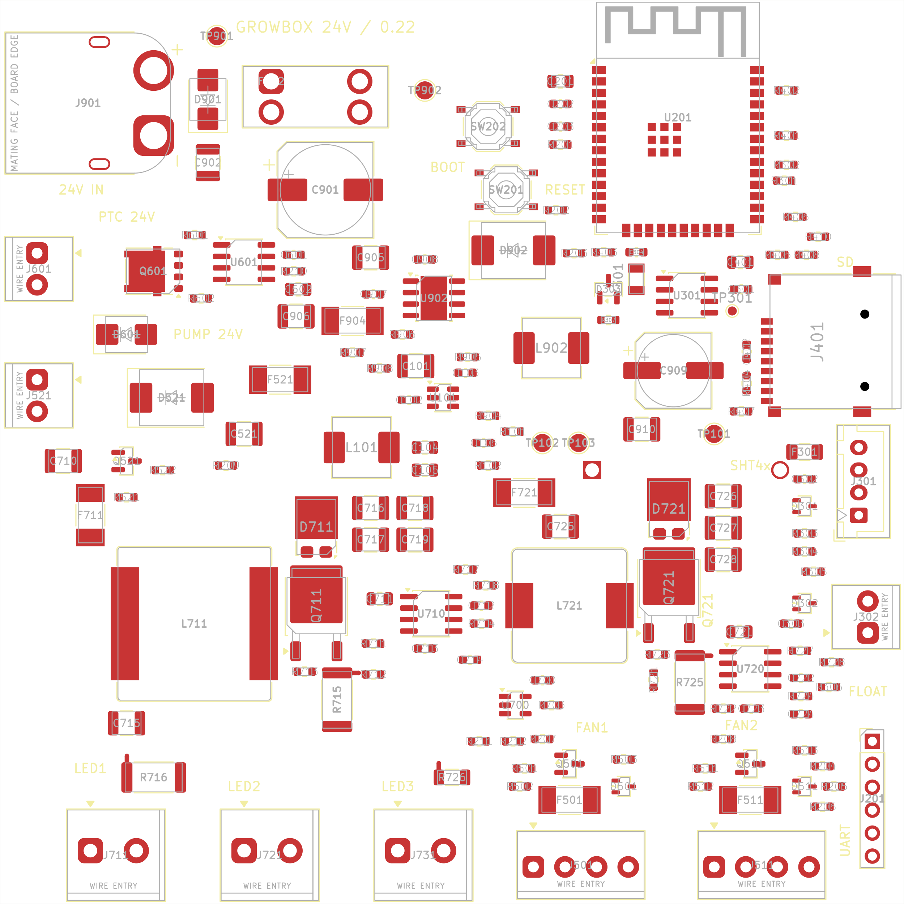

# Размещение 0.22

Плата 100×100 мм, без крепёжных отверстий; 170 компонентов, включая четыре net-tie. Разъёмы и microSD по краям, батарейный держатель снизу. Трассировка завершена; при DFM-доводке F301 сдвинут на 0,1 мм, остальные позиции сохранены. Текущее состояние — [ROUTING.md](ROUTING.md), производственные исправления — [FAB.md](FAB.md).

**3D-модели.** Все детали платы имеют 3D-модели в `libraries/GrowBox.3dshapes/`. Силовые SMD и microSD строит `../models3d/power.py` ([SOURCES_power.md](libraries/GrowBox.3dshapes/SOURCES_power.md)). Разъёмы, держатели и кнопки строит `../models3d/mechanical.py` ([SOURCES_mechanical.md](libraries/GrowBox.3dshapes/SOURCES_mechanical.md)). На плату их привязывает `../sync_models.py`, а `verify_placement.py` проверяет, что у каждой детали есть модель. Самые высокие детали: F902 со вставкой — расчётно 17,15 мм (не измерено, для корпуса закладывать не меньше 18 мм), клеммы KANGNEX — 14,07 мм, DORABO — 8,6 мм, XT60 — 8,4 мм, L711 — 6,7 мм. Снизу BT301 — 4,1 мм. Net-tie NT712 и NT722 сдвинуты на 0,1 мм от шунтов R716/R726: зазор до площадок возврата LED стал 0,55 мм при норме класса LED48 0,5 мм.

Снимки размещения до трассировки и DFM-доводки (актуальная геометрия — в файле платы):

[SVG сверху](../review/Placement_v22_top.svg) · [вид снизу](../review/Placement_v22_bottom.png) · [SVG снизу](../review/Placement_v22_bottom.svg). Контуры корпусов и позиционные обозначения на Fab показаны для проверки; это не будущая шелкография. Изображения прежних ревизий — в архиве, см. [CHANGELOG.md](CHANGELOG.md#архив).

## Механика и доступ

| Область | Размещение |
|---|---|
| Левый край | XT60 J901, PTC J601, помпа J521; ввод питания и силовые выходы рядом с защитой и ключами |
| Нижний край | J711 — LED-панель; J721/J731 — две линейки общего CH2; J501/J511 — вентиляторы |
| Правый край | microSD J401, SHT4x J301, поплавок J302, программатор J201 |
| Верхний край | ESP32 U201, антенна направлена наружу; вокруг неё запрет меди, переходных отверстий и компонентов на всех четырёх слоях |
| Центр слева | PTC/помпа, предохранители; над ними входные TVS и ёмкость |
| Центр | LMR16020 24→12 В, затем TPS54202 12→3,3 В |
| Нижняя половина | Boost CH1 и CH2: ключ DPAK фланцем стока к дросселю и анодам диода, выходные конденсаторы у катода, шунт под выводом истока |
| RTC | Кварц с C304 у выводов OSCI/OSCO U301, D303/R307 рядом |
| Снизу | BT301 MYOUNG, центр круглого корпуса примерно (127,9; 102,0) мм, доступ к батарейке со стороны B.Cu |

Все 12 внешних разъёмов находятся у края. Передняя грань DB125 утоплена примерно на 0,5–0,6 мм, WJ500V — на 0,4 мм, XT60 — на 0,65 мм, горловина microSD — на 0,35 мм. Снаружи платы нужны свободное место под карту, ответную часть XT60 и провода; над клеммами — доступ к винтам. Проверка контура подтверждает место на самой PCB, а не совместимость с ещё не заданным корпусом.

Держатель батарейки THT: два контакта проходят на верхнюю сторону. Их положение скорректировано, чтобы не пересекать верхние компоненты и их площадки. Под корпусом держателя на нижней стороне не размещать другие детали. Высота F902 со вставкой и механизм извлечения батарейки проверяются на образцах.

## Стек и правила изготовления

Подтверждены пользователем JLCPCB, FR4, четыре слоя, **толщина 1,6 мм, наружная медь 1 oz, внутренняя 0,5 oz** (30.09.2026). Эти опции указать при заказе. Для исходной модели взят стандартный [JLC7628](https://cart.jlcpcb.com/client/template/placeOrder/impedance.html). [JLCPCB указывает](https://jlcpcb.com/help/article/jlcpcb-copper-weight), что наружная и внутренняя медь выбираются отдельно.

| Последовательность | Толщина в модели, мм | Назначение при трассировке |
|---|---:|---|
| F.Cu | 0,035 | Компоненты, короткие силовые петли, сигналы |
| FR4 7628 prepreg | 0,2104 | Диэлектрик |
| In1.Cu | 0,0152 | По возможности сплошная земля, за исключением антенны |
| FR4 7628 core | 1,0650 | Диэлектрик |
| In2.Cu | 0,0152 | Распределение вспомогательного питания и часть сигналов |
| FR4 7628 prepreg | 0,2104 | Диэлектрик |
| B.Cu | 0,035 | Силовые возвраты/полигоны, сигналы, батарейка |

Сумма слоёв с маской по 0,01 мм с каждой стороны — **1,6062 мм**; номинал заказа — 1,6 мм. Это исходная геометрия, не гарантированный изготовителем стек и не расчёт контролируемого импеданса. Основной ток нельзя переносить на тонкую внутреннюю медь без расчёта сечений и переходных отверстий.

В `PCB_V1.kicad_pro` заданы минимальная дорожка 0,20 мм, минимальный зазор 0,15 мм (обычно 0,20 мм по классу), медь до края 0,50 мм; сквозное via 0,65/0,30 мм минимум, кольцо минимум 0,15 мм. Предустановки via: 0,65/0,30, 0,80/0,40 и 1,00/0,50 мм. Между металлизированными отверстиями выводов принято 0,45 мм. Это проектные ограничения с запасом относительно [возможностей JLCPCB](https://jlcpcb.com/capabilities/pcb-capabilities), без microvia и глухих отверстий.

| Класс цепи | Зазор, мм | Начальная ширина дорожки, мм |
|---|---:|---:|
| Default | 0,20 | 0,25 |
| MAIN24 | 0,40 | 8,00 |
| HEATER24 | 0,40 | 4,00 |
| LED_INPUT | 0,40 | 3,00 |
| AUX24 | 0,40 | 1,00 |
| LED48 | 0,50 | 1,00 |
| SWITCH | 0,20 | 2,00 |
| PWR12 | 0,25 | 0,80 |
| PWR3V3 | 0,20 | 0,50 |

Ширины — исходные настройки интерактивного трассировщика, **не подтверждённые токовые рейтинги**. Расчёт меди при подтверждённом стеке — `analyze_copper.py` и [ROUTING_PREP.md](ROUTING_PREP.md).

`PCB_V1.kicad_dru` дополнительно задаёт минимальные via и расстояние отверстий. Единственное исключение зазора — **между площадками U902**: 0,20 мм согласно штатному TI DDA land pattern, где VIN соседствует с GND EP. Исключение не распространяется на дорожки или окружающую медь. DRC exclusions не добавлялись.

## Проверки и механика

`verify_placement.py` входит в `check_all.py`. Проверки геометрии — [DESIGN.md](DESIGN.md#проверки), параметры изготовления — [FAB.md](FAB.md). Пользователь проверяет образцы разъёмов, полярность XT60, высоту F902 со вставкой и доступ к батарейке в корпусе; общие открытые вопросы — [DESIGN.md](DESIGN.md#открытые-вопросы).
