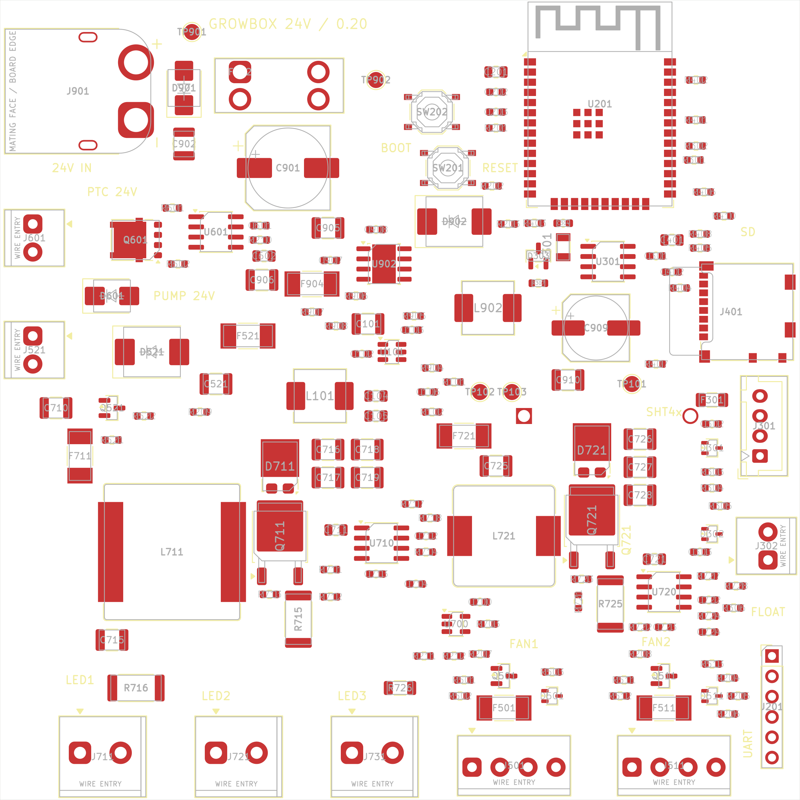
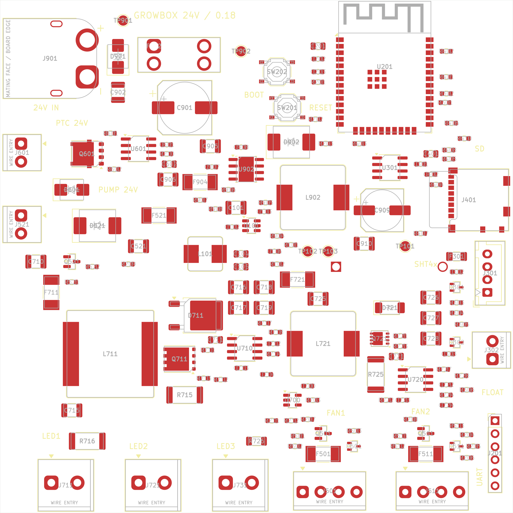

# PCB_V1 — размещение, 0.20

**0.20 (30.09.2026):** 165 компонентов. Новые корпуса ключей (DPAK) и диодов (TO-277A) LED-каналов потребовали переставить узлы CH1/CH2. Ключ стоит фланцем стока к дросселю и анодам диода, выходные конденсаторы — у катода, шунт — под выводом истока. Кварц RTC с C304 — у выводов OSCI/OSCO U301, D303/R307 рядом. Сдвинуты 29 деталей, 132 на прежних местах; L101/L902 заменены на месте. DRC 0, 340 несоединённых связей. Подробности — [COST_DOWN_020.md](COST_DOWN_020.md).

[SVG сверху](../review/Placement_v20_top.svg) · [вид снизу, зеркальный](../review/Placement_v20_bottom.png) · [SVG снизу](../review/Placement_v20_bottom.svg). Ниже — описание размещения 0.18; механика краёв, стек и правила с тех пор не менялись.

## Размещение 0.18

Состояние на 2026-09-29, ветка `pcb-simplify`, от `main` b05b209. После [упрощения схемы](SIMPLIFICATION.md) **161 компонент** внутри **100×100 мм**: 160 сверху, THT-держатель CR2032 снизу. Удалены D401–D403, R409, R701/R702; координаты, поворот и сторона остальных деталей сохранены. Крепёжных отверстий нет. Трассировка отложена: дорожек, переходных отверстий и медных полигонов нет, **336 связей не соединены**. Плата не готова к изготовлению.

[SVG сверху](../review/Placement_v18_top.svg) · [вид снизу, зеркальный](../review/Placement_v18_bottom.png) · [SVG снизу](../review/Placement_v18_bottom.svg). Контуры корпусов и позиционные обозначения на Fab показаны для проверки; они не являются будущей шелкографией. Модели 3D есть не для всех деталей; L101 теперь соответствует библиотечному SRP7028A высотой 2,8 мм. Полную высоту сборки по неполным моделям подтвердить нельзя.

## Механика и доступ

| Область | Размещение |
|---|---|
| Левый край | XT60 J901, PTC J601, помпа J521; ввод питания и силовые выходы рядом с защитой и ключами |
| Нижний край | J711 — LED-панель; J721/J731 — две линейки общего CH2; J501/J511 — вентиляторы |
| Правый край | microSD J401, SHT4x J301, поплавок J302, программатор J201 |
| Верхний край | ESP32 U201, антенна направлена наружу; вокруг неё запрет меди, переходных отверстий и компонентов на всех четырёх слоях |
| Центр слева | PTC/помпа, предохранители; над ними входные TVS и ёмкость |
| Центр | LMR16020 24→12 В, затем TPS54202 12→3,3 В |
| Нижняя половина | Boost CH1 и CH2, выходные конденсаторы и шунты |
| Снизу | BT301 MYOUNG, центр круглого корпуса примерно (127,9; 102,0) мм, доступ к батарейке со стороны B.Cu |

Все 12 внешних разъёмов находятся у края. Передняя грань DB125 утоплена примерно на 0,5–0,6 мм, WJ500V — на 0,4 мм, XT60 — на 0,65 мм. У microSD передняя грань на 0,325 мм внутри контура: по чертежу Molex вставленная карта выступает примерно на 3,675 мм. Снаружи платы нужны свободное место под карту, ответную часть XT60 и провода; над клеммами — доступ к винтам. Проверка контура подтверждает место на самой PCB, а не совместимость с ещё не заданным корпусом.

Держатель батарейки THT: два контакта проходят на верхнюю сторону. Их положение скорректировано, чтобы не пересекать верхние компоненты и их площадки. Под корпусом держателя на нижней стороне не размещать другие детали. Самая высокая из проверенных клемм WJ500V — 14,07 мм; высота F902 со вставкой и механизм извлечения батарейки проверяются на образцах.

## Стек и правила изготовления

Подтверждены пользователем JLCPCB, FR4, четыре слоя и 1 oz. **Рабочее допущение:** номинальная толщина 1,6 мм, наружная медь 1 oz, внутренняя 0,5 oz. Пользователь не подтвердил отдельно вес внутренних слоёв; при заказе эти опции необходимо сверить. Для исходной модели взят стандартный [JLC7628](https://cart.jlcpcb.com/client/template/placeOrder/impedance.html). [JLCPCB указывает](https://jlcpcb.com/help/article/jlcpcb-copper-weight), что наружная и внутренняя медь выбираются отдельно.

| Последовательность | Толщина в модели, мм | Назначение при трассировке |
|---|---:|---|
| F.Cu | 0,035 | Компоненты, короткие силовые петли, сигналы |
| FR4 7628 prepreg | 0,2104 | Диэлектрик |
| In1.Cu | 0,0152 | По возможности сплошная земля, за исключением антенны |
| FR4 7628 core | 1,0650 | Диэлектрик |
| In2.Cu | 0,0152 | Распределение вспомогательного питания и часть сигналов |
| FR4 7628 prepreg | 0,2104 | Диэлектрик |
| B.Cu | 0,035 | Силовые возвраты/полигоны, сигналы, батарейка |

Сумма слоёв с маской по 0,01 мм с каждой стороны — **1,6062 мм**; номинал заказа — 1,6 мм. Это исходная геометрия, не гарантированный изготовителем стек и не расчёт контролируемого импеданса. Основной ток нельзя переносить на тонкую внутреннюю медь без расчёта сечений и переходных отверстий.

В `PCB_V1.kicad_pro` заданы минимальная дорожка 0,20 мм, минимальный зазор 0,15 мм (обычно 0,20 мм по классу), медь до края 0,50 мм; сквозное via 0,65/0,30 мм минимум, кольцо минимум 0,15 мм. Предустановки via: 0,65/0,30, 0,80/0,40 и 1,00/0,50 мм. Между металлизированными отверстиями выводов принято 0,45 мм. Это проектные ограничения с запасом относительно [возможностей JLCPCB](https://jlcpcb.com/capabilities/pcb-capabilities), без microvia и глухих отверстий.

| Класс цепи | Зазор, мм | Начальная ширина дорожки, мм |
|---|---:|---:|
| Default | 0,20 | 0,25 |
| MAIN24 | 0,40 | 8,00 |
| HEATER24 | 0,40 | 4,00 |
| LED_INPUT | 0,40 | 3,00 |
| AUX24 | 0,40 | 1,00 |
| LED48 | 0,50 | 1,00 |
| SWITCH | 0,20 | 2,00 |
| PWR12 | 0,25 | 0,80 |
| PWR3V3 | 0,20 | 0,50 |

Ширины — исходные настройки интерактивного трассировщика, **не подтверждённые токовые рейтинги**. Для общего входа (расчётный средний ток до 11,01 А), PTC и LED-входов нужны расчёт полигонов, узких мест и переходных отверстий с учётом температуры. Силовую медь и количество тепловых via следует определить при трассировке.

`PCB_V1.kicad_dru` дополнительно задаёт минимальные via и расстояние отверстий. Единственное исключение зазора — **между площадками U902**: 0,20 мм согласно штатному TI DDA land pattern, где VIN соседствует с GND EP. Исключение не распространяется на дорожки или окружающую медь. DRC exclusions не добавлялись.

## Интеграция проверки деталей

- Применены 11 замен footprint из [PRE_LAYOUT_PARTS_REVIEW.md](PRE_LAYOUT_PARTS_REVIEW.md): XT60, восемь клемм, держатель CR2032 и L101. У XT60 проверяются отверстия 3,0 мм и пазы 0,9×2,0 мм, у KANGNEX — отверстия 1,5 мм. Пересекающая увеличенные площадки шелкография XT60 удалена; полный корпус сохранён на Fab.
- В схему перенесены MPN критичных шунтов, C602/C902 и делителей LMR16020; исправлены ссылки J401/L711. Вставка F902 — отдельный расходник Littelfuse 0297010.WXNV, схема F902 продолжает описывать держатель.
- R716 выбран **FOJAN FRM252WFR180TM, 0,18 Ом, 1 %, 2 Вт, ±50 ppm/K**. Ток панели 1,111 А номинально; свет 75,66 Вт номинально / 78,72 Вт на границе допусков FB и сопротивления при 48 В. Это расчёт установившегося режима, без динамических выбросов. Геометрия 2512 сохранена.
- `sync_board.py` сохраняет сторону установки при замене footprint. Новый footprint сначала присоединяется к плате: вызов `Flip` без родительской платы аварийно завершал KiCad 10.0.5. Проверено на реальной замене нижнего держателя.

## Проверки и следующий этап

`check_all.py --write` обновил BOM и отчёты 0.18 после упрощения схемы. [Результат проверок](../review/Checks_v18.txt): ERC **0/0**, 108 групп соединений, 15 GPIO, 161 footprint и 428 логических выводов совпадают со схемой. DRC **0 нарушений**, отдельно **336 несоединённых связей**. `verify_placement.py` проверяет габарит, края разъёмов, доступ к microSD, нижнюю сторону батарейки, keepout антенны и присутствие правил изготовления. Все 161 позиции, повороты и стороны дополнительно сравнены с исходной платой 0.17: совпадают.

Повторный запуск без `--write` проверяет воспроизводимость расчётных отчётов и BOM. Изображения схемы отрендерены из SVG KiCad через Sharp. Ниже остаётся план трассировки на будущее; в этой ревизии она отложена пользователем.

1. Вход, TVS, предохранители и PTC: короткие пути тока, силовая медь и возвраты без прохода через сигнальную землю.
2. LMR16020/TPS54202 и оба AL8853: минимальная площадь импульсных петель; локальные входные/выходные конденсаторы; Kelvin-дорожки шунтов и делителей отдельно от силового тока. Следовать layout-разделам [LMR16020](https://www.ti.com/lit/ds/symlink/lmr16020.pdf) и [AL8853](https://www.diodes.com/datasheet/download/AL8853.pdf).
3. Логика, SD, датчики и вентиляторы; тепловые via и земля. Сохранить [область антенны ESP32](https://docs.espressif.com/projects/esp-hardware-design-guidelines/en/latest/esp32/pcb-layout-design.html).
4. После трассировки — заливка, ERC/DRC с нулём несоединённых связей, проверка токовых сечений, Gerber/drill и сборочных файлов. До заказа сверить полярность/посадку XT60, детали держателей, выбранный стек и полный заказной BOM.

Пуск, устойчивость контуров, температура, защита и работа во влажной среде требуют проверки прототипа; исходные номиналы компенсации пока не квалифицированы. Они перечислены в [DESIGN.md](DESIGN.md).

## История: интеграция main перед слиянием PR #6

2026-09-29 сохранены расчёт стоимости и решение о самостоятельной сборке из PR #7/#8. Все SMT-компоненты уже находятся на верхней стороне; снизу только THT-держатель, устанавливаемый после оплавления SMT. Размещение и файлы схемы при этом объединении не менялись.

Общий `check_all.py` теперь проверяет и размещение, и стоимость. Номер аппаратной ревизии 0.17 отделён от номера снимка цен v16: это данные от 2026-09-28, которые уже включали выбранные в 0.17 MPN. Отчёты [BOM_cost_v17.txt](../review/BOM_cost_v17.txt) и [JLC_assembly_v17.txt](../review/JLC_assembly_v17.txt) пересчитаны для текущей схемы и footprint без повторного запроса цен. Геометрия и количество деталей не изменились.
