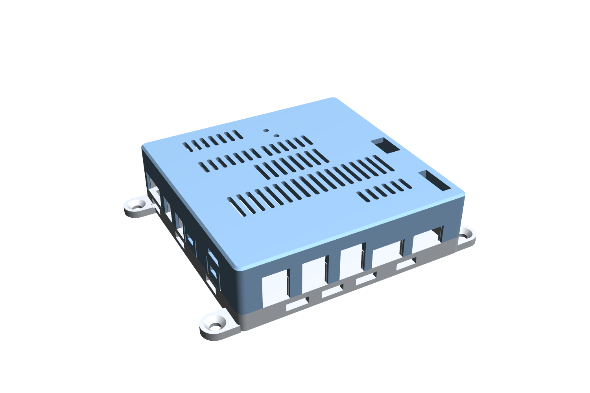
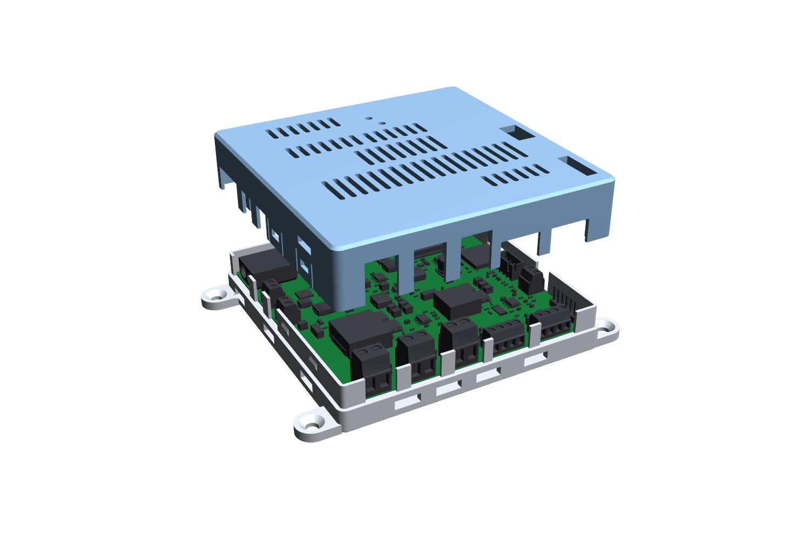

# Корпус GrowBox для PCB_V1

Печатный корпус из двух деталей — **основание** и **крышка** — для платы 100×100 мм (ревизия 0.22). Крепление на стену ушками, вентиляция, FDM из PLA, крышка держится на защёлках без винтов. Модель параметрическая (CadQuery), построена по STEP-экспорту платы и проверена на пересечения с ним. **Не печаталась:** допуски защёлок и размеры вилок ответных разъёмов нужно проверить на первом отпечатке.



## Файлы

| Файл | Что это |
|---|---|
| `GrowBox_base.step`, `GrowBox_lid.step` | Детали в системе координат STEP платы (X = x KiCad, Y = −y KiCad, низ платы Z = 0): их можно загрузить вместе с `kicad-cli pcb export step` и посмотреть сборку |
| `GrowBox_base_print.stl`, `GrowBox_lid_print.stl` | Для печати, уже в печатной ориентации: основание — полом на стол, крышка — потолком на стол. Поддержки не нужны |
| `GrowBox_*_coupon_print.stl` | Фрагмент стенки 14 мм с защёлкой, основание и крышка. Печатать **первым** (около получаса) и проверить посадку |
| `enclosure.py` | Генератор. Все размеры и места вырезов — константы в начале файла |
| `check_enclosure.py` | Проверка по STEP платы: пересечения и зазоры |
| `render_enclosure.py` | Картинки в `renders/` |

## Конструкция



- Габарит 106×106×31,2 мм, с ушами 132 мм. Стенки 2,6 мм (кратно соплу 0,4 мм). Внутри 100,8×100,8: зазор до края платы 0,4 мм.
- Плата **лежит** на опорах (8 блоков 8×2 мм под рёбрами крышки и 4 угловых, верх опор на уровне низа платы) и прижимается сверху 8 рёбрами крышки на свободных участках края. Отверстий в плате не нужно. Опоры стоят только в местах, где снизу у края ничего нет; снизу плата занята лишь держателем BT301.
- От пола до платы 5,2 мм (низ BT301 −4,19 мм, зазор 1,01 мм), от платы до потолка 19,4 мм. Самая высокая деталь F902 (18,75 мм от низа платы) — зазор до потолка **2,25 мм**; высота F902 не измерена, см. «Что проверить».
- Стык «паз–шип»: на основании шип 1,2 мм (поднимается на 9 мм над плоскостью стыка z = 1,6 мм, то есть над верхом платы), на крышке внешняя юбка 1,2 мм, зазор 0,2 мм. Стык лежит на уровне верха платы, поэтому вырезы под разъёмы открыты в юбке и шипе сверху вниз, без перемычек.
- Защёлки: 7 окон 6 мм в юбке крышки (по трём сторонам) против гребней 0,6 мм на шипе основания. Юбка вокруг окна отделена щелями 0,8 мм и работает как гибкий палец (прогиб 0,4 мм, расчётная деформация около 0,7 %). Гребень скошен под 27° со стороны надевания крышки и под 23° со стороны снятия.
- Снять крышку: плоская отвёртка в прорезь у нижней кромки крышки (две: на верхней стороне, x = 82, и на правой, у верхнего угла, y = 62), затем приподнять по очереди каждую сторону.
- Стенное крепление: 4 уха, отверстие Ø4,5 мм с конусом под головку Ø8,6 мм; межосевое расстояние 120×92 мм. Крепёж в комплект не входит. Металла рядом с антенной ESP32 нет.

### Отверстия

Сторона и координаты даны по виду платы в KiCad (верх — край антенны ESP32, низ — клеммы светодиодов и вентиляторов).

| Где | Что | Окно |
|---|---|---|
| Слева | J901 XT60 (вилка ответного разъёма) | y 52,6…70,2, до z 11,2 |
| Слева | J601 PTC, J521 помпа | y 75,3…83,8 и 89,3…97,8, до z 10,8 |
| Снизу | J711, J721, J731 светодиоды (KANGNEX 5,08) | x 57,0…68,7, 74,0…85,7, 91,0…102,7, до z 16,3 |
| Снизу | J501, J511 вентиляторы | x 106,3…121,8 и 126,3…141,8, до z 10,8 |
| Справа | J401 microSD (карту вставлять и вынимать) | y 79,9…95,7, до z 4,65 |
| Справа | J302 поплавок | y 114,2…122,7, до z 10,8 |
| Потолок | J301 датчик SHT4x (XH, вилка сверху) | x 141,8…149,3, y 96,4…110,1 |
| Потолок | J201 UART (штыревая 1×6, Dupont сверху) | x 144,2…148,8, y 129,8…146,9 |
| Потолок | SW201 RESET, SW202 BOOT | трубки Ø6,4/Ø2,8, низ трубки z 4,5 (колпачок 3,1) — нажимать скрепкой или зубочисткой |

Вентиляция: щели в потолке над горячими узлами (вход питания и F902, Q601/U601, U902/L902/D902, U101/L101, драйверы светодиодов, Q501/Q511), горизонтальные щели в стенках крышки и щели в стенках основания под платой. Пол сплошной: он прижат к стене.

Клеммы затягиваются при снятой крышке; провода уходят в открытые вырезы.

## Печать

- Сопло 0,4, слой 0,2, 3 периметра, 4 верхних/нижних слоя, заполнение 20–25 %, без поддержек. Масса обеих деталей около 50–60 г (объём 38,5 + 39,8 см³ при сплошной модели).
- Мосты: щели в стенках 10 мм и окна защёлок 6 мм. Нужен обдув; при провисании уменьшить `BASE_SLOT_L` / `LID_SLOT_L`.
- **PLA размягчается около 55–60 °C.** Греющиеся ключи, диоды и дроссели пластика не касаются (до потолка не меньше 9 мм), но под нагрузкой проверьте температуру крышки и стенок на прототипе (цель из DESIGN: подъём SS5P10 ниже 50 °C). Если они нагреваются выше ~50 °C, печатайте из **PETG**: геометрия от материала не зависит.

## Проверка

`python check_enclosure.py` (в окружении с CadQuery; STEP платы выгружается через `kicad-cli`, путь к нему — `KICAD_CLI`) на ревизии 0.22:

- основание и крышка не пересекаются;
- ни одна деталь платы не пересекается с корпусом; 256 деталей из 295 заведомо дальше 2,5 мм от оболочки, остальные 39 проверены точно: **минимальный зазор 0,65 мм** (экран ESP32 до стенки), клеммы KANGNEX 0,8 мм, microSD 0,73 мм, кнопки до трубок 1,45 мм, F902 до потолка 2,25 мм;
- сама плата касается опор и низа рёбер по построению.

Ключевые сечения: [через защёлку](renders/section_snap.png), [через клемму](renders/section_front.png). Остальные виды: [без крышки](renders/open_top.png), [крышка изнутри](renders/lid_inside.png), [сзади](renders/assembled_back.png).

## Что проверить на первом отпечатке

1. Печать фрагментов-купонов: посадка шипа и гибкость пальца (нужны ли поправки `JOINT_GAP`, `RIDGE_P`, `SNAP_WIN`).
2. Высота F902 со вставкой: сейчас потолок 21,0 мм (`Z_CEIL`) при расчётной высоте 18,75 мм. После измерения проверить зазор и при необходимости изменить `Z_CEIL`.
3. Вилки ответных разъёмов (XT60, XH, Dupont) и провода в вырезах; 3D-модели разъёмов упрощены.
4. Крепёж (винты и дюбели) и фактическое направление монтажа.

## Пересборка

```sh
python -m pip install cadquery==2.8.0 vtk
python pcb/enclosure/enclosure.py
python pcb/enclosure/check_enclosure.py            # с --fast быстрее, без списка зазоров
kicad-cli pcb export step --force --no-dnp -o board.step pcb/PCB_V1/PCB_V1.kicad_pcb
python pcb/enclosure/render_enclosure.py board.step
```

При изменении расстановки платы пересоберите корпус и повторите проверку: окна и опоры привязаны к координатам разъёмов и свободным участкам края.
